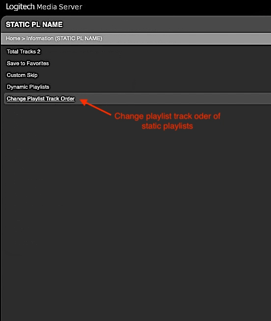

PotPourri
====

A collection of various small [features](https://github.com/AF-1/lms-potpourri#features).
  
## Requirements

- LMS version >= 8.**4**
- LMS database = **SQLite**

 
<a href="https://github.com/AF-1/">⬅️ <b>Back to the list of all plugins</b></a>

   

## Features:
- **Change the track order of *saved static* playlists** (context menu) or **client playlists** (*App menu icon*). Multiple sort options available.

- Set a **power-on volume level for players** that's enforced when players are switched on.[^1] The (sub)menu is listed on the *LMS Settings > Player* page.

- Set a **time to turn off *all* players** each day. No more worries about idle players that you forgot to switch off.

- **Export static playlists** to playlist files with custom **file paths and file extensions**[^2].

- **Adjust album *release types*** based on keywords in the album title (e.g. [Single]).

- Use **(key)words** in your music files' <b><u>comment</u> tags</b> to add **extra information** to the **song details page** / context menu information or to define and display **custom title formats**[^3].
   

## Screenshots[^4] (of some features)

   

## Installation

### Using the repository URL

- Add the repository URL below at the bottom of *LMS* > *Settings* > *Plugins* and click *Apply*: 
[https://raw.githubusercontent.com/AF-1/sobras/main/repos/lmsghonly/public.xml](https://raw.githubusercontent.com/AF-1/sobras/main/repos/lmsghonly/public.xml)

- Install the plugin from the added repository at the bottom of the page.
 

### Manual Install

Please read the instructions on how to [install a plugin manually](https://github.com/AF-1/sobras/wiki/Manual-installation-of-LMS-plugins).
   

## Reporting a new issue

If you want to report a new issue, please fill out this [**issue report template**](https://github.com/AF-1/lms-potpourri/issues/new?template=bug_report.md&title=%5BISSUE%5D+).
    

[^1]:based on parts of E. Koldinger's [**Reset Volume**](https://github.com/koldinger/ResetVolume)
[^2]:Files will be exported to the **LMS playlists folder** or alternatively to the **LMS preferences folder**.
[^3]:<b>Custom title formats</b> can be used to display a <i>short</i> string or a character on the <i>Now Playing screensaver</i> and the <i>Music Information plugin screensaver</i> or to append a string to the track title.
[^4]: The screenshots might not correspond to the UI of the latest release in every detail.
